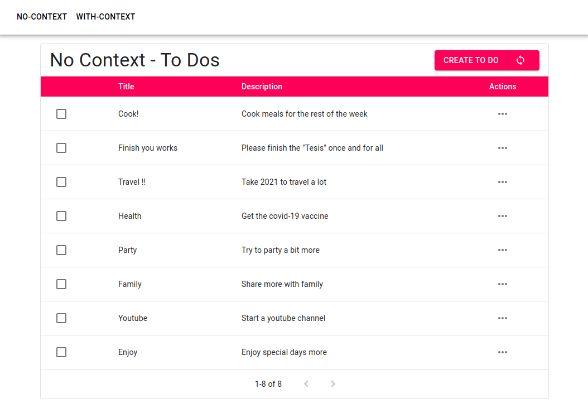
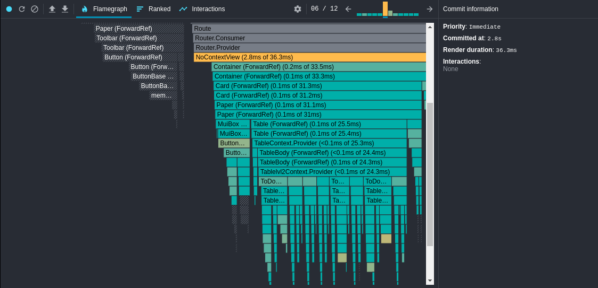
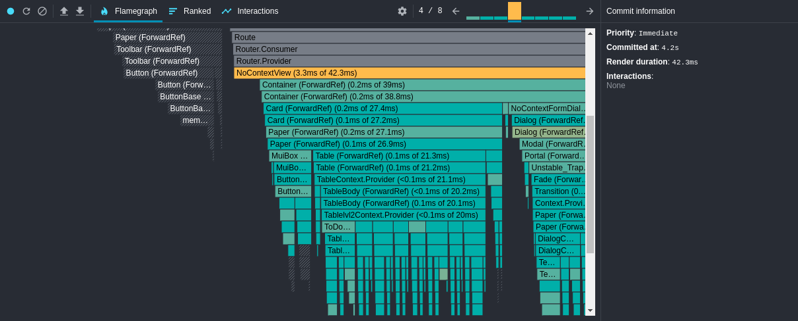
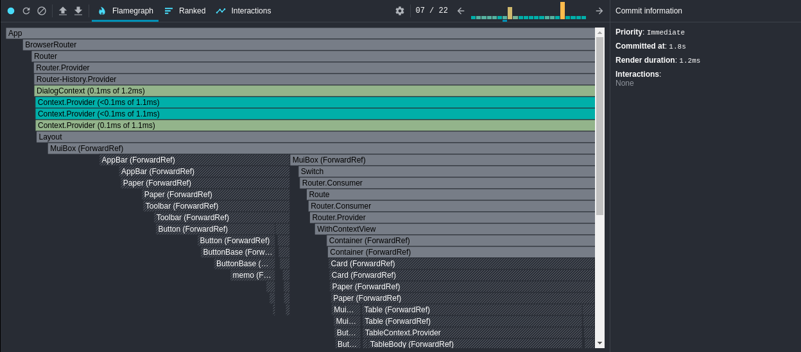
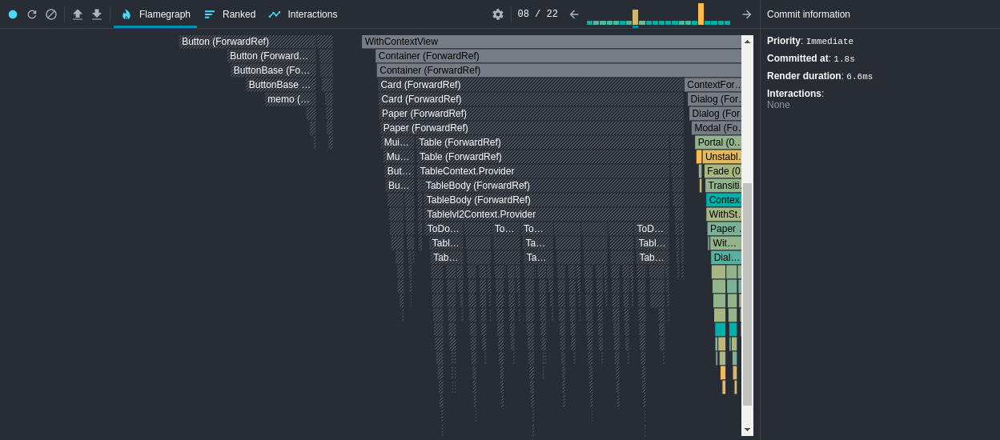

# Dialog paradign performance test

This project aims to compare the performance between two Dialog Component usage paradigms in React that i have seen in a few projects. The app shows a navigation bar with two sections where each section represents a paradigm.



As you can see in the image above, the app is just a basic CRUD interface for things the user should do. The first section is called "no-context" because the dialogs here are handled with no context state, just local state in the parent component, which introduces code like this:

```js
function Parent () {
  const [form, setForm] = useState({ open: false, selected: null });
  const [del, setDel] = useState({ open: false, selected: null });

  const onCreate = () => {/* Change state in form to open the dialog */}

  const onUpdate = () => {/* Change state in form to open the dialog */}

  const onCloseForm = () => {/* Change state in form to close it */}

  const onDelete = () => {/* Change state in del to open the dialog */}

  const onCloseDelete = () => {/* Change state in del to close it */}

  return (
    <div>
      <Button onClick={onCreate} />
      <Table 
        onUpdate={onUpdate}
        onDelete={onDelete}
      />
      <ToDoFormDialog 
        open={form.open}
        toDo={form.selected}
        onClose={onCloseForm}
      />
      <DeleteDialog 
        open={del.open}
        toDo={del.selected}
        onClose={onCloseDelete}
      />
    </div>
  )
}
```

On the other hand we have a context alternative that introduces code like this:

```js
  function Parent () {
  const openDialog = useDialogOpener();

  const onCreate = () => {
    /**
     * T represents the type of the
     * parameters needed by the dialog 
     * when opening
     */
    openDialog<T>('<dialog-id>', T);
  }

  return (
    <div>
      <Table />
      <ToDoFormDialog />
      <DeleteDialog />
    </div>
  )
}

function TableItem () {
  const openDialog = useDialogOpener();

  const onUpdate = () => openDialog<T>('form-dialog-id', T);

  const onDelete = () => openDialog<T>('del-dialog-id', T);

  return (
    <Item />
  )
}

function ToDoFormDialog () {
  const { open, params } = useDialogParams('form-dialog-id');
  const closeDialog = useDialogCloser();

  return (
    // ...
  )
}
```


## Installation

First of all, to install dependencies run in the command line on project folder:

```
  npm run install
```

The app information is stored on [8base](https://www.8base.com/), a BAAS with an interface for building mysql tables, for this project the schema is:

### ToDo
| Name        | Type                   |
|-------------|------------------------|
| identifier  | number (Autoincrement) |
| title       | string                 |
| description | string                 |
| finished    | switch                 |

The app does not require authentication so remember to change authorization rights on 8base for Guests so they can also list, create, update and delete To Dos.

One you have 8base configured, you just need to run:

```
  npm run start
```

## Results
To compare the performance on the two approaches the React Profiler Tool was used, lets go first with the "no-context" approach

### No Context
#### Opening the **create to-do** dialog



As you can see, the app took about 36ms to render the dialog, having a direct impact in the component that contained it.

#### Closing the **create to-do** dialog


Closing the dialog took about 42ms to render. Other thing to note here is that even when we only opened the ToDo form dialog, the delete dialog also needed computations to render, as well as every item in the table, as this view only has a two dialogs to handle, the performance in practice does not seem to be so bad, but as this view gets more complex the performance is going to be slower.

### With Context
### Opening the **create to-do** dialog




As you can see in the images, opening the dialog using a global state needed to commits to make the ui changes, first, a commit that lasted 1.2ms that changed the state in the context, and the second 6.6ms to make a total of 7.8ms in comparison with the 36ms that took on the no-context alternative.

One important aspect of the context approach, is that when the dialog opens, react only renders the context and that specific dialog that we a opening, this means that adding more dialogs to the parent component does not have to lower performance over time.

